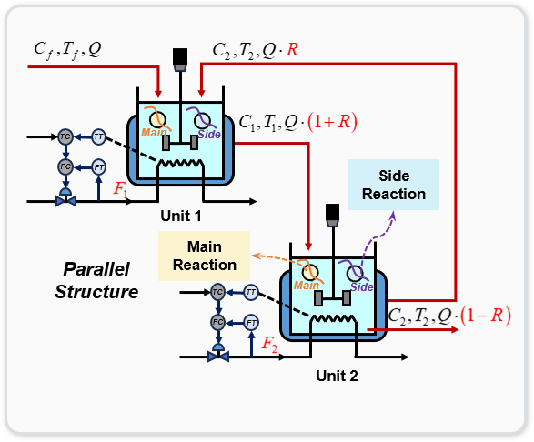
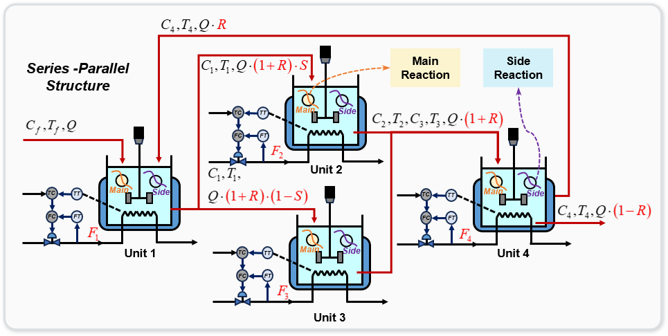

# Multi-Configuration CSTR Control Environments

This repository contains three different Continuous Stirred Tank Reactor (CSTR) simulation environments for reinforcement learning research in process control. Each environment represents a chemical reactor system with different configurations, complexity levels, and control challenges.

## Overview

Continuous Stirred Tank Reactors (CSTRs) are common process units in chemical engineering where reactions occur in a continuously stirred vessel. These environments simulate the dynamic behavior of CSTRs with exothermic chemical reactions, where proper control of temperature and concentration is critical for operation.

The three CSTR environments provided are:
1. **Simple Series CSTR** - A basic two-reactor series configuration
2. **Recycle Series CSTR** - A two-reactor series with product recycle
3. **Serial-Parallel CSTR** - A complex configuration with one input reactor, two parallel reactors, and one output reactor

These environments are designed for reinforcement learning research, but can also be used for traditional control algorithm development and testing.

## Environment Descriptions

### 1. Simple Series CSTR Environment


**Configuration**: Two reactors in series, where the output from the first reactor flows into the second.

**State Space** (4 dimensions):
- C1: Concentration in Reactor 1 [mol/L]
- T1: Temperature in Reactor 1 [K]
- C2: Concentration in Reactor 2 [mol/L]
- T2: Temperature in Reactor 2 [K]

**Action Space** (2 dimensions):
- F1: Cooling water flow rate for Reactor 1 [L/min]
- F2: Cooling water flow rate for Reactor 2 [L/min]

**Control Objective**: Control the concentration C2 to a desired setpoint.

**Usage Example**:
```python
import gymnasium as gym
from cstr_environments import TwoSeriesCSTREnv

env = TwoSeriesCSTREnv(default_target=0.20)
obs, info = env.reset()

for step in range(400):
    action = your_controller(obs)  # Your control algorithm
    obs, reward, terminated, truncated, info = env.step(action)
    
    if terminated or truncated:
        break
```

### 2. Recycle Series CSTR Environment



**Configuration**: Two reactors in series with recycle stream from the second reactor back to the first.

**State Space** (4 dimensions):
- C1: Concentration in Reactor 1 [mol/L]
- T1: Temperature in Reactor 1 [K]
- C2: Concentration in Reactor 2 [mol/L]
- T2: Temperature in Reactor 2 [K]

**Action Space** (3 dimensions):
- F1: Cooling water flow rate for Reactor 1 [L/min]
- F2: Cooling water flow rate for Reactor 2 [L/min]
- R: Recycle ratio [0-0.9], portion of Reactor 2 output recycled back to Reactor 1

**Control Objective**: Control the concentration C2 to a desired setpoint while minimizing operational costs.

**Key Challenges**:
- Managing the trade-off between product quality and recycle cost
- Handling the feedback dynamics introduced by the recycle stream

**Usage Example**:
```python
import gymnasium as gym
from cstr_environments import RecycleTwoSeriesCSTREnv

env = RecycleTwoSeriesCSTREnv(default_target=0.20)
obs, info = env.reset()

for step in range(400):
    action = your_controller(obs)  # Your control algorithm
    obs, reward, terminated, truncated, info = env.step(action)
    
    if terminated or truncated:
        break
```

### 3. Serial-Parallel CSTR Environment



**Configuration**: Complex system with four reactors - an input reactor (R1), two parallel reactors (R2 & R3), and an output reactor (R4) with recycle back to R1.

**State Space** (8 dimensions):
- C1, T1: Concentration and temperature in Reactor 1 [mol/L, K]
- C2, T2: Concentration and temperature in Reactor 2 [mol/L, K]
- C3, T3: Concentration and temperature in Reactor 3 [mol/L, K]
- C4, T4: Concentration and temperature in Reactor 4 [mol/L, K]

**Action Space** (6 dimensions):
- F1, F2, F3, F4: Cooling water flow rates for each reactor [L/min]
- S: Split ratio [0-1], controlling flow distribution from R1 to R2 vs R3
- R: Recycle ratio [0-0.9], controlling recycle from R4 back to R1

**Control Objective**: Control the concentration C4 to a desired setpoint while efficiently utilizing parallel reactors and managing recycle.

**Key Challenges**:
- Coordinating multiple control variables
- Balancing flow between parallel reactors to maximize efficiency
- Managing the dynamics of both split and recycle streams

**Usage Example**:
```python
import gymnasium as gym
from cstr_environments import SerialParallelCSTREnv

env = SerialParallelCSTREnv(default_target=0.25)
obs, info = env.reset()

for step in range(400):
    action = your_controller(obs)  # Your control algorithm
    obs, reward, terminated, truncated, info = env.step(action)
    
    if terminated or truncated:
        break
```

## Environment Parameters

Each environment supports the following common parameters:

- `render_mode`: Visualization mode ("human" or "rgb_array")
- `default_target`: Default target concentration setpoint
- `min_concentration`: Minimum allowable concentration
- `max_concentration`: Maximum allowable concentration
- `init_mode`: Initialization mode ("random", "static", or "fixed")
- `enable_side_reaction`: Whether to simulate side reactions
- `enable_catalyst_decay`: Whether to simulate catalyst deactivation
- `process_params`: Optional dictionary of custom process parameters

## Reward Functions

All environments use a comprehensive reward function with components for:

1. **Control Performance**: Rewards for minimizing the error between actual and target concentrations
2. **Stability**: Rewards for maintaining smooth operation and avoiding rapid changes
3. **Economic Efficiency**: Balances operational costs (cooling water, pumping) with production value
4. **Safety**: Penalties for approaching operational constraints or dangerous conditions

The exact mathematical formulations for each component differ between environments, reflecting their specific challenges. Detailed equations are provided in the documentation for each environment.

## Evaluation

The repository includes evaluation utilities to assess controller performance across multiple episodes:

```python
from cstr_environments import evaluate_model, TwoSeriesCSTREnv

env = TwoSeriesCSTREnv()
results = evaluate_model(your_trained_model, env, num_episodes=10)
```

Evaluation metrics include:
- Average reward per episode
- Convergence time to target setpoint
- Control accuracy (final error)
- Economic metrics (operational costs, production value)
- Safety metrics (constraint violations)

## Extending the Environments

The environments can be customized by modifying reaction parameters, physical dimensions, or economic factors:

```python
custom_params = {
    "Q": 60,       # Modified feed flow rate [L/min]
    "V1": 120,     # Modified reactor volume [L]
    "delta_H": -7.2e4  # Modified reaction enthalpy [J/mol]
}

env = RecycleTwoSeriesCSTREnv(process_params=custom_params)
```

## License

This project is licensed under the MIT License - see the LICENSE file for details.

## Acknowledgments

These environments are based on established chemical engineering principles and are designed to provide realistic challenges for reinforcement learning and advanced control algorithms.
