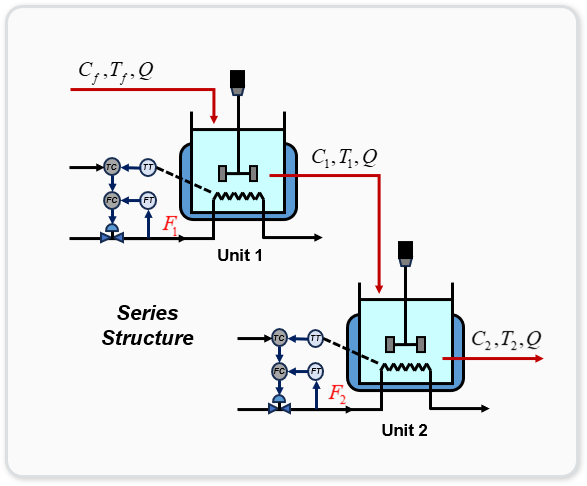
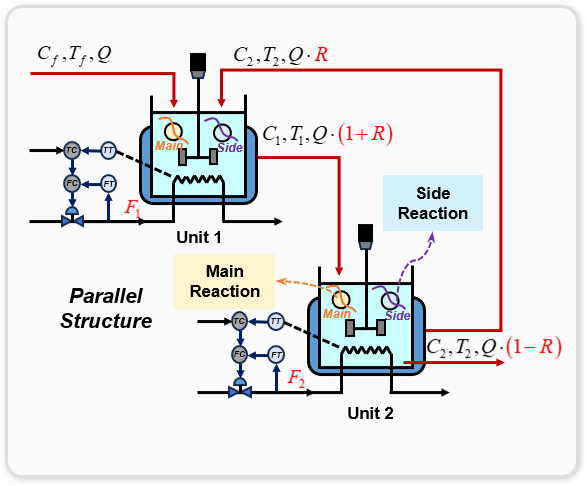
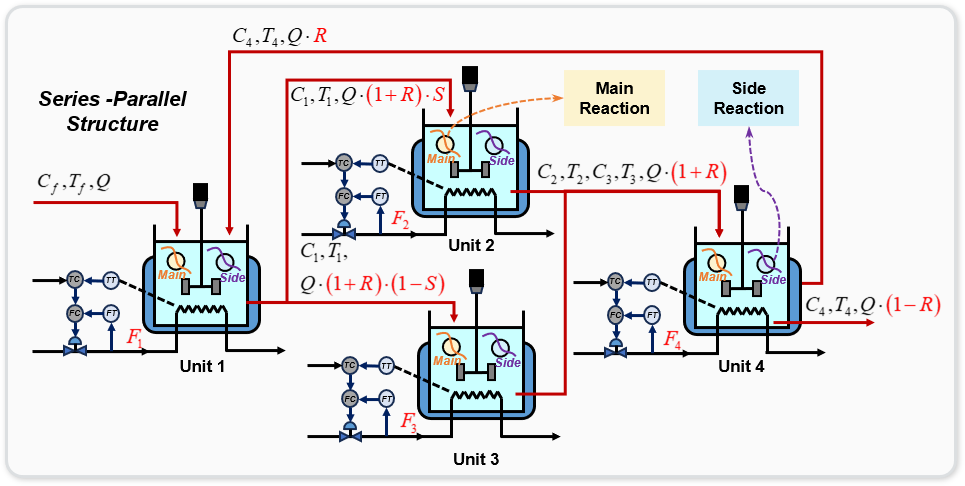

# 多构型CSTR控制环境

本代码库包含三种不同的连续搅拌反应釜（CSTR）仿真环境，用于过程控制领域的强化学习研究。每个环境代表具有不同配置、复杂度和控制挑战的化学反应器系统。

## 概述

连续搅拌反应釜（CSTR）是化学工程中常见的过程单元，反应在连续搅拌的容器中进行。这些环境模拟了带有放热化学反应的CSTR动态行为，其中温度和浓度的适当控制对于操作至关重要。

本代码库提供的三种CSTR环境为：
1. **简单串联CSTR** - 基本的两反应器串联配置
2. **回流串联CSTR** - 带产品回流的两反应器串联配置
3. **串并联CSTR** - 复杂配置，包含一个输入反应器、两个并联反应器和一个输出反应器

这些环境设计用于强化学习研究，但也可用于传统控制算法的开发和测试。

## 环境描述

### 1. 简单串联CSTR环境



**配置**：两个串联的反应器，第一个反应器的输出流入第二个反应器。

**状态空间**（4维）：
- C1：反应器1中的浓度 [mol/L]
- T1：反应器1中的温度 [K]
- C2：反应器2中的浓度 [mol/L]
- T2：反应器2中的温度 [K]

**动作空间**（2维）：
- F1：反应器1的冷却水流量 [L/min]
- F2：反应器2的冷却水流量 [L/min]

**控制目标**：将浓度C2控制到期望的设定点。

**使用示例**：
```python
import gymnasium as gym
from cstr_environments import TwoSeriesCSTREnv

env = TwoSeriesCSTREnv(default_target=0.20)
obs, info = env.reset()

for step in range(400):
    action = your_controller(obs)  # 你的控制算法
    obs, reward, terminated, truncated, info = env.step(action)
    
    if terminated or truncated:
        break
```

### 2. 回流串联CSTR环境



**配置**：两个串联的反应器，第二个反应器的一部分输出回流到第一个反应器。

**状态空间**（4维）：
- C1：反应器1中的浓度 [mol/L]
- T1：反应器1中的温度 [K]
- C2：反应器2中的浓度 [mol/L]
- T2：反应器2中的温度 [K]

**动作空间**（3维）：
- F1：反应器1的冷却水流量 [L/min]
- F2：反应器2的冷却水流量 [L/min]
- R：回流比 [0-0.9]，反应器2输出回流到反应器1的比例

**控制目标**：将浓度C2控制到期望的设定点，同时最小化运行成本。

**主要挑战**：
- 管理产品质量和回流成本之间的权衡
- 处理回流引入的反馈动态特性

**使用示例**：
```python
import gymnasium as gym
from cstr_environments import RecycleTwoSeriesCSTREnv

env = RecycleTwoSeriesCSTREnv(default_target=0.20)
obs, info = env.reset()

for step in range(400):
    action = your_controller(obs)  # 你的控制算法
    obs, reward, terminated, truncated, info = env.step(action)
    
    if terminated or truncated:
        break
```

### 3. 串并联CSTR环境



**配置**：复杂系统，包含四个反应器 - 一个输入反应器（R1）、两个并联反应器（R2和R3）和一个输出反应器（R4），R4有回流到R1。

**状态空间**（8维）：
- C1, T1：反应器1中的浓度和温度 [mol/L, K]
- C2, T2：反应器2中的浓度和温度 [mol/L, K]
- C3, T3：反应器3中的浓度和温度 [mol/L, K]
- C4, T4：反应器4中的浓度和温度 [mol/L, K]

**动作空间**（6维）：
- F1, F2, F3, F4：各反应器的冷却水流量 [L/min]
- S：分流比 [0-1]，控制从R1到R2与R3的流量分配
- R：回流比 [0-0.9]，控制从R4回流到R1的比例

**控制目标**：将浓度C4控制到期望的设定点，同时高效利用并联反应器并管理回流。

**主要挑战**：
- 协调多个控制变量
- 平衡并联反应器之间的流量以最大化效率
- 管理分流和回流流的动态特性

**使用示例**：
```python
import gymnasium as gym
from cstr_environments import SerialParallelCSTREnv

env = SerialParallelCSTREnv(default_target=0.25)
obs, info = env.reset()

for step in range(400):
    action = your_controller(obs)  # 你的控制算法
    obs, reward, terminated, truncated, info = env.step(action)
    
    if terminated or truncated:
        break
```

## 环境参数

每个环境支持以下通用参数：

- `render_mode`：可视化模式（"human"或"rgb_array"）
- `default_target`：默认目标浓度设定点
- `min_concentration`：允许的最小浓度
- `max_concentration`：允许的最大浓度
- `init_mode`：初始化模式（"random"、"static"或"fixed"）
- `enable_side_reaction`：是否模拟副反应
- `enable_catalyst_decay`：是否模拟催化剂失活
- `process_params`：可选的自定义过程参数字典

## 奖励函数

所有环境使用包含以下组成部分的综合奖励函数：

1. **控制性能**：根据实际浓度与目标浓度之间的误差给予奖励
2. **稳定性**：保持平稳操作并避免快速变化的奖励
3. **经济效率**：平衡运行成本（冷却水、泵送）与产品价值
4. **安全性**：接近操作约束或危险条件时的惩罚

每个环境的具体数学公式不同，反映了它们各自的特定挑战。每个环境的文档中提供了详细的方程式。

## 评估

本代码库包含用于评估控制器在多个回合中性能的工具：

```python
from cstr_environments import evaluate_model, TwoSeriesCSTREnv

env = TwoSeriesCSTREnv()
results = evaluate_model(your_trained_model, env, num_episodes=10)
```

评估指标包括：
- 每回合平均奖励
- 收敛到目标设定点的时间
- 控制精度（最终误差）
- 经济指标（运行成本、产品价值）
- 安全指标（约束违反）

## 扩展环境

可以通过修改反应参数、物理尺寸或经济因素来自定义环境：

```python
custom_params = {
    "Q": 60,       # 修改后的进料流量 [L/min]
    "V1": 120,     # 修改后的反应器体积 [L]
    "delta_H": -7.2e4  # 修改后的反应焓 [J/mol]
}

env = RecycleTwoSeriesCSTREnv(process_params=custom_params)
```

## 许可证

本项目采用MIT许可证 - 详见LICENSE文件。

## 致谢

这些环境基于成熟的化学工程原理，旨在为强化学习和高级控制算法提供真实的挑战。
